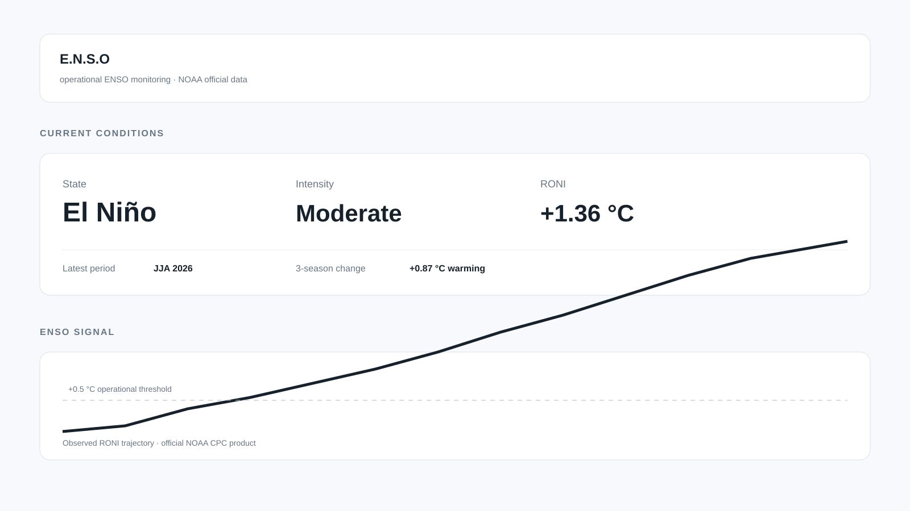
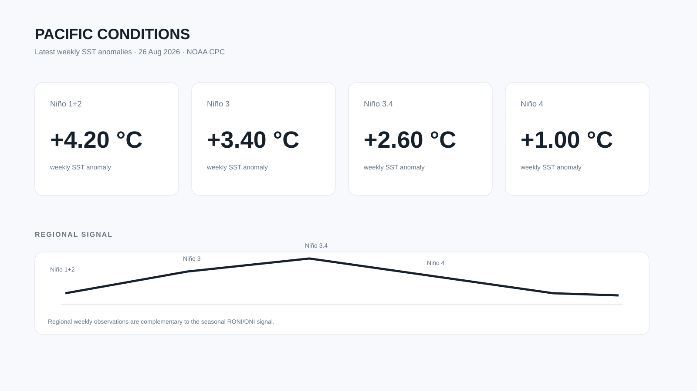
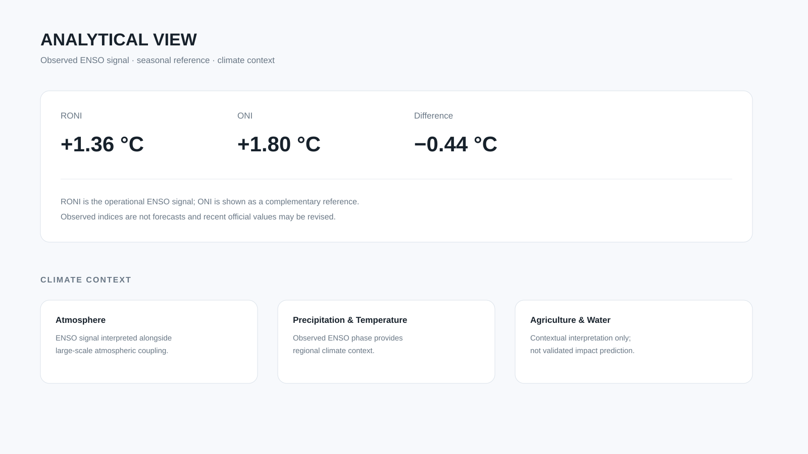

# E.N.S.O — Operational ENSO Intelligence

**Operational monitoring of the El Niño–Southern Oscillation using official NOAA climate products.**

E.N.S.O is a focused, single-page climate intelligence observatory that turns official NOAA CPC ENSO products into a compact and traceable view of the current regime, recent evolution, historical context, and Pacific conditions.

> **Product principle:** observe first, interpret clearly, document the source. E.N.S.O is an observational intelligence product — not a forecasting system.

**Portfolio case:** [docs/portfolio-case.md](docs/portfolio-case.md)

## Visual overview

Selected presentation assets for portfolio, GitHub and social posts:







> These visuals are presentation assets based on the validated observatory outputs. They are not a substitute for the live Streamlit interface.

## What it answers

The observatory is designed around five questions:

1. **What is the current ENSO state?**
2. **How strong is the current signal?**
3. **Is the signal strengthening or weakening?**
4. **Which historical RONI trajectories look similar?**
5. **What are the latest conditions across the Niño regions?**

## Observatory view

The interface is intentionally one-page and ordered for rapid executive reading:

| Section | Purpose |
|---|---|
| **Current Conditions** | Current ENSO state, intensity, latest RONI and recent change |
| **ENSO Signal** | Historical RONI trajectory and operational thresholds |
| **Historical Analogues** | Descriptive trajectory similarity against historical RONI windows |
| **ENSO Regime Timeline** | Historical non-neutral episodes detected from the RONI series |
| **Pacific Conditions** | Weekly SST anomalies across Niño 1+2, 3, 3.4 and 4 |
| **Analytical View** | RONI vs ONI and concise climate context |
| **Methodology** | Processing logic and scientific guardrails |
| **Data & Provenance** | Products, sources and data-integrity policy |

## Data provenance

E.N.S.O reads live products published by **NOAA Climate Prediction Center (CPC)**. The application does not use synthetic, mocked, or fallback climate observations.

| Product | Role | Source |
|---|---|---|
| **RONI** | Primary operational ENSO signal | NOAA CPC — `RONI.ascii.txt` |
| **ONI** | Complementary reference | NOAA CPC — `oni.ascii.txt` |
| **Weekly Niño indices** | Latest regional Pacific SST anomalies | NOAA CPC — `wksst9120.for` |
| **Monthly Niño indices** | Complementary regional product | NOAA CPC — `sstoi.indices` |
| **ERSSTv6** | NOAA SST product availability/context | NOAA NCEI / PSL |

The application displays the observation period separately from the retrieval/update timestamp. If an official source cannot be loaded or parsed, the application reports the data as unavailable rather than inventing a value.

## Scientific methodology

### ENSO phase

The operational phase classification uses the RONI threshold convention:

- **El Niño:** RONI ≥ **+0.5 °C**
- **Neutral:** −0.5 °C < RONI < +0.5 °C
- **La Niña:** RONI ≤ **−0.5 °C**

### Intensity

Magnitude bands are aligned with CPC communication thresholds:

- **Weak:** 0.5–0.9 °C
- **Moderate:** 1.0–1.4 °C
- **Strong:** 1.5–1.9 °C
- **Very Strong:** ≥2.0 °C

These bands describe index magnitude and do not, by themselves, constitute an independent official event declaration.

### Historical regimes

Historical El Niño and La Niña episodes are identified from the real RONI series as contiguous same-state periods lasting at least **five consecutive overlapping seasons**.

### Historical analogues

The analogue engine compares the latest eight RONI observations with historical eight-observation windows. Similarity is based on the trajectory of change within each window and ranked by RMSE, while excluding the current period and nearby continuation windows.

Analogues are **descriptive, not predictive**. A historical match does not imply that future ENSO conditions will reproduce the analogue episode.

### Trends

Recent change metrics describe observed movement in the index. They are not forecasts and should not be interpreted as long-term climate trends from a short window.

## Architecture

```text
app.py
  ├── NOAA CPC acquisition
  │     ├── RONI
  │     ├── ONI
  │     └── Weekly Niño indices
  ├── Analysis
  │     ├── ENSO classification
  │     ├── intensity bands
  │     ├── recent evolution
  │     └── historical regime / analogue analysis
  └── Streamlit observatory UI

src/
├── analysis/      # ENSO classification, trends and event logic
├── data/          # configuration, thresholds and metadata
├── noaa/          # NOAA CPC / NCEI access and parsers
└── ui/            # observatory theme and reusable components

tests/             # offline unit and integrity tests
scripts/           # validation helpers
```

The application keeps the interactive path deliberately small: the core observatory uses the published index products directly and does not require a large gridded SST download.

## Run locally

```bash
pip install -r requirements.txt
streamlit run app.py
```

## Validate

```bash
python -m compileall -q .
pytest -q
```

The test suite covers ENSO classification, NOAA parsing, application integrity, and regime-timeline logic.

## Design principles

- **Official data first:** NOAA products are the source of observational truth.
- **No fabricated observations:** no mock, synthetic, or fallback climate values.
- **Observation ≠ forecast:** the interface does not present observed indices as predictions.
- **Primary signal is explicit:** RONI is the operational core; ONI is complementary.
- **Traceable interpretation:** methodology and provenance remain visible in the product.
- **Focused scope:** the observatory prioritizes clarity over feature accumulation.

## Limitations

- E.N.S.O is observational; it does not generate seasonal forecasts.
- Recent official index values may be revised by NOAA.
- Intensity bands are a project communication layer aligned with CPC thresholds.
- Weekly and seasonal indices summarize different products and can legitimately diverge.
- Climate-impact context is qualitative; the core application does not claim validated regional impact prediction for Brazil.
- No gridded Pacific anomaly map is required for core operation.

## Project status

**v1.0-ready operational observatory.**

The current scope is intentionally frozen around ENSO monitoring, historical context, and transparent provenance. Future research can be developed as separate, explicitly validated modules rather than expanding the core observatory indiscriminately.

## Attribution

Climate data are provided by NOAA. Publications or analyses derived from this software should cite the original NOAA CPC / NCEI products.
